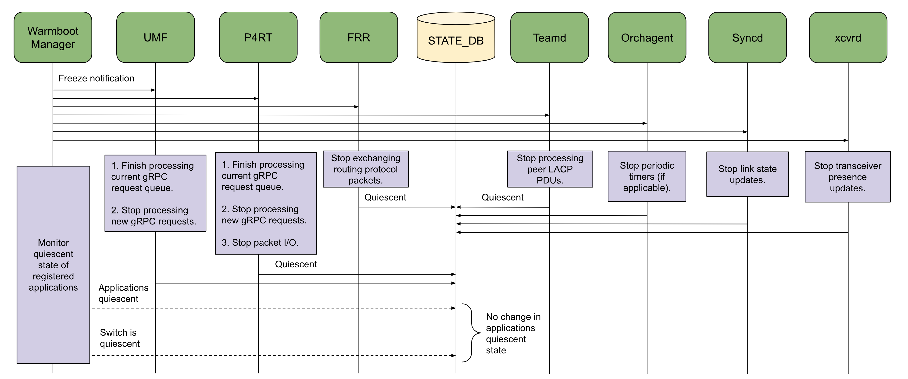
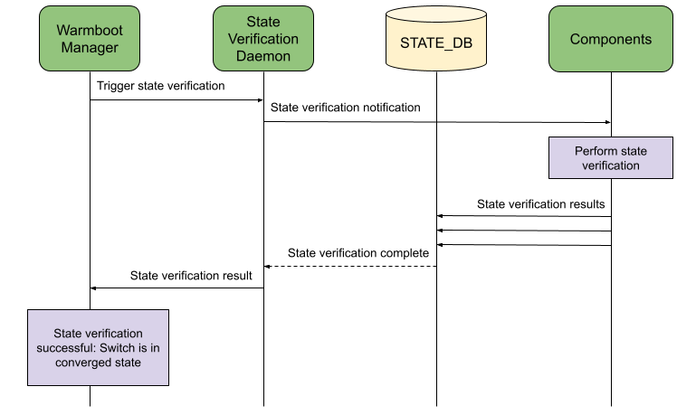
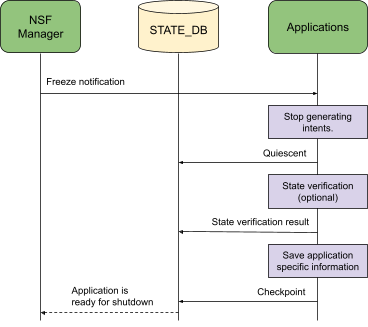
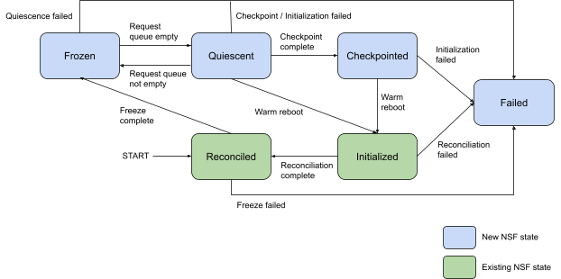

# NSF Manager HLD


## Table of Content


- [Revision](#revision)
- [Scope](#scope)
- [Definitions/Abbreviations](#definitions-abbreviations)
- [Overview](#overview)
- [Requirements](#requirements)
- [Architecture Design](#architecture-design)
- [High-Level Design](#high-level-design)
  * [NSF Details Registration](#nsf-details-registration)
  * [Shutdown Orchestration](#shutdown-orchestration)
    + [Phase 1: Freeze Components & Wait for Switch Quiescence](#phase-1--freeze-components---wait-for-switch-quiescence)
    + [Phase 2: State Verification (Optional)](#phase-2--state-verification--optional-)
    + [Phase 3: Trigger Checkpointing](#phase-3--trigger-checkpointing)
    + [Phase 4: Prepare and Perform Reboot](#phase-4--prepare-and-perform-reboot)
    + [Application Shutdown Optimization](#application-shutdown-optimization)
  * [Reconciliation Monitoring](#reconciliation-monitoring)
  * [Component Warmboot States](#component-warmboot-states)
- [SAI API](#sai-api)
- [Configuration and management](#configuration-and-management)
- [Warmboot and Fastboot Design Impact](#warmboot-and-fastboot-design-impact)
- [Restrictions/Limitations](#restrictions-limitations)
- [Testing Requirements/Design](#testing-requirements-design)
- [Open/Action items - if any](#open-action-items---if-any)


### Revision


<table>
  <tr>
   <td>Rev
   </td>
   <td>Rev Date
   </td>
   <td>Author(s)
   </td>
   <td>Change Description
   </td>
  </tr>
  <tr>
   <td>v0.1
   </td>
   <td>9/28/2023
   </td>
   <td>Google
   </td>
   <td>Initial version
   </td>
  </tr>
</table>


### Scope

This document captures the high-level design for NSF Manager - a new daemon that is responsible for shutdown orchestration and reconciliation monitoring during warm reboot, and the location of this daemon in SONiC.


### Definitions/Abbreviations


<table>
  <tr>
   <td><strong>NSF</strong>
   </td>
   <td>Non-Stop Forwarding
   </td>
  </tr>
  <tr>
   <td><strong>Applications</strong>
   </td>
   <td>Higher-layer components that may or may not be running depending on the switch role e.g. Teamd, BGP, P4RT etc.
   </td>
  </tr>
  <tr>
   <td><strong>Infrastructure Components</strong>
   </td>
   <td>Switch stack components that are essential for switch operation irrespective of switch role e.g. Orchagent, Syncd and transceiver daemon
   </td>
  </tr>
</table>


### Overview

SONiC uses [fast-reboot](https://github.com/sonic-net/sonic-utilities/blob/master/scripts/fast-reboot) and [finalize\_warmboot.sh](https://github.com/sonic-net/sonic-buildimage/blob/master/files/image_config/warmboot-finalizer/finalize-warmboot.sh) scripts for warm reboot reconciliation. The former script is responsible for preparing the platform and database for reboot and orchestrating switch shutdown. The latter script is responsible for monitoring the reconciliation status of a fixed set of switch stack components and eventually removing the warm-boot flag from Redis DB. There are multiple drawbacks of using a bash script:


*   Separate binaries need to be developed for each component to send shutdown related notifications.
*   The rich set of Redis DB features provided by swss-common library cannot be utilized.
*  Cannot develop an efficient framework that sends notifications to components and monitors their warm-boot states.

Additionally, the current SONiC warm shutdown algorithm has custom shutdown related notifications for different components that triggers their warm shutdown logic. For example, Orchagent uses _freeze_ notification and notifies its ready status via notification channel. Syncd uses _pre-shutdown_ and _shutdown_ notifications and notifies its status via Redis DB.

The proposal is to introduce a new component called NSF Manager that will be responsible for both shutdown orchestration and reconciliation monitoring during warm reboot. It will leverage Redis DB features provided by swss-common to create a common framework for warm-boot orchestration. As a result, there will be a unified framework for warm-boot orchestration for all switch stack components. NSF Manager will be an alternative to the existing SONiC warm-boot orchestation scripts and thus both these orchestration frameworks will co-exist in SONiC. More details about this are described in the [Backward Compatibility](#backward-compatibility) section.


### Requirements

The current design covers warm reboot orchestration daemon along with the warm shutdown and bootup sequence. It also covers the additional warmboot states introduced due to the warm shutdown sequence. It does not cover fast reboot.


### Architecture Design


NSF Manager will run as a part of the Reboot Backend daemon inside a new _Framework_ docker. The high-level design of this daemon is specified [here](https://github.com/sonic-net/SONiC/pull/1489). Since NSF Manager will run inside a docker, it will communicate with processes in other dockers using notification channel and Redis DB, and will perform host actions using DBUS.


### High-Level Design


NSF Manager will be an alternative to the existing [fast-reboot](https://github.com/sonic-net/sonic-utilities/blob/master/scripts/fast-reboot) and [finalize\_warmboot.sh](https://github.com/sonic-net/sonic-buildimage/blob/master/files/image_config/warmboot-finalizer/finalize-warmboot.sh) scripts to perform shutdown orchestration and reconciliation monitoring during warm reboot. It will use a registration based mechanism to determine the switch stack components that need to perform an orchestrated shutdown and bootup. This ensures that the NSF Manager design is generic, flexible and also avoids any hardcoding of component information in NSF Manager.


#### NSF Details Registration


```
Component = <name>
Docker = <name>
Freeze = <True>/<False>
Checkpoint = <True>/<False>
Reconciliation = <True>/<False>
```


Components that want to participate in warm-boot orchestration need to register the above details with NSF Manager. NSF Manager will use these registration details to determine the components that are going to participate in the orchestrated shutdown sequence and monitor reconciliation statuses during bootup. If a component doesn’t register with the NSF Manager then it will continue to operate normally until it is shutdown in [Phase 4](#phase-4-prepare-and-perform-reboot). Components that modify the switch state should register with NSF Manager because they can change the state of other components such as Orchagent, Syncd etc. that participate in the warm reboot orchestration and thus they can impact the warm reboot process.

Components that want to participate in an orchestrated shutdown during warm reboot need to set _freeze = true_. NSF Manager will wait for the quiescence of all components that have _freeze = true_ in their registration. If _checkpoint = True_ only then will NSF Manager wait for the component to complete checkpointing. Components that want NSF Manager to monitor their reconciliation status need to set _reconciliation = true_.


#### Shutdown Orchestration

During warm reboot, NSF Manager will orchestrate switch shutdown in a multi-phased approach that ensures that the switch stack is in a stable state before the intent/state is saved. It will perform shutdown in the following phases:


*   Phase 1: Freeze components & wait for switch quiescence
*   Phase 2: Perform state verification (optional)
*   Phase 3: Trigger checkpointing
*   Phase 4: Prepare and perform reboot


##### Phase 1: Freeze Components & Wait for Switch Quiescence




NSF Manager will send freeze notification to all registered components and will wait for the quiescence of only those components that have set _freeze = true_. Upon receiving the freeze notification, the component will complete processing the current request queue and stop generating new intents. Stopping new intents from being generated means that boundary components should stop processing requests from external components (external events) and all components should stop their periodic timers that generate new requests (internal events). For example:


*   UMF will stop listening to new gRPC requests from the controller.
*   P4RT will stop listening to new gRPC requests from the controller and stop packet I/O.
*   xcvrd will stop listening to transceiver updates such as module presence.
*   Syncd will stop listening to link state events from the BCM chip.
*   Orchagent will stop periodic internal timers.
*   BGP will stop exchanging packets with the peers.
*   Teamd will stop exchanging LACP PDUs with the peers.

After all components have been freezed, the switch would eventually reach a state wherein each component stops generating new events and thus the switch becomes quiescent. This is because:


*   Switch boundaries that generate new events have been stopped.
*   All timers that generate new events have been stopped.
*   All components have completed processing their pending requests and thus there are no in-flight messages.

After receiving the freeze notification, the components will update their quiescent state in STATE DB when they receive a new request (i.e. they are no longer quiescent) and when they complete processing their current request queue (i.e. they become quiescent). NSF Manager will monitor the quiescent state of all components in STATE DB to determine that the switch has become quiescent and thus further state changes won’t occur in the switch. If all components are in quiescent state then NSF Manager will declare that the switch has become quiescent and thus the switch has attained its final state. NSF Manager will wait for a period of time for the switch to become quiescent after which it will determine that warm reboot failed and abort the warm reboot operation.


##### Phase 2: State Verification (Optional)




Since the switch is in quiescent state, this will be the final state of the switch before reboot. NSF Manager will trigger state verification to ensure that the switch is in a consistent state. Reconciling from an inconsistent state might cause traffic loss and thus it is important to ensure that the switch is in a consistent state before warm rebooting. NSF Manager will abort warm reboot operation if state verification fails.

An additional flag will be added in Redis DB which will be used NSF Manager to determine whether this phase is required during warm-boot orchestration.


##### Phase 3: Trigger Checkpointing


NSF Manager will send checkpoint notification to all registered components and wait for only to those components that set _checkpoint = true_ to trigger checkpointing i.e. save internal states to either the DB or persistent file system. Checkpointing after state verification is successful ensures that the switch is reconciling from a consistent state. NSF Manager will wait for a period of time for the components to update STATE DB with their checkpointing status after which it will abort the warm reboot operation.


##### Phase 4: Prepare and Perform Reboot


At this point, the DB will be backed up, containers will be shutdown, the platform will be prepared for reboot and the switch will be rebooted.


##### Application Shutdown Optimization




Higher layer applications are generally independent and their shutdown is not dependent on quiescence of other switch stack components. For example, upon receiving a freeze notification Teamd can stop exchanging LACP packets, perform state verification (optional) and checkpoint LACP states i.e. transition from Phase 1 to Phase 3 without waiting for NSF Manager to send further notifications. The design allows applications to transition through these phases independently as long as they continue to update their warmboot state in STATE DB. NSF Manager will monitor these states and will handle the applications’ phase transitions. In such a scenario, applications need to set _freeze = true_ and _checkpoint = false_ and thus the freeze notification will result in the application to transition from Phase 1 to Phase 3. 


#### Reconciliation Monitoring


Upon bootup, components will detect warm-boot flag in STATE DB and reconcile to the state before reboot. Components that registered _reconciliation = true_ will update their warm-boot state = RECONCILED in STATE DB after they have completed reconciliation. NSF Manager will monitor the reconciliation status of these registered components during warm bootup. Subsequently, the components will start their normal operation and listen to new requests. The proposed reconciliation monitoring mechanism is similar to the existing mechanism except that components being monitored are based on the NSF details registration as opposed to hardcoded list of components.


#### Component Warmboot States

Based on the shutdown and reconciliation sequence mentioned above, a component will transition through the following states during warm reboot:


*   Frozen (warm shutdown)
*   Quiescent (warm shutdown)
*   Checkpointed (optional, warm shutdown)
*   Initialized (warm bootup)
*   Reconciled (warm bootup)
*   Failed (warm shutdown or bootup)




Upon receiving a freeze notification, a component will transition to _frozen_ state when it has stopped generating new intents for which it is the source. Subsequently, it will transition to _quiescent_ state when it has completed processing all requests. It might transition between _frozen_ and _quiescent_ states when it receives a new request from some other switch component and after it has completed processing all requests i.e. a component might transition between _frozen_ and _quiescent_ states if it processes an intent in freeze mode. If a component fails to perform its freeze routine i.e. fails to stop generating new intents for which it is the source then it will transition to _failed_ state. Upon receiving a checkpoint notification, a component will transition to _checkpointed_ state after it has completed checkpointing or to _failed_ state if checkpointing failed.

After warm reboot, a component will transition to _initialized_ state after it has completed its initialization routine. It will transition to _reconciled_ state after it has completed reconciliation. It will transition to _failed_ state if its initialization or reconciliation fails.

Components will update their state in STATE DB using [setWarmStartState()](https://github.com/sonic-net/sonic-swss-common/blob/master/common/warm_restart.cpp#L223) API during the different warm reboot stages. NSF Manager will monitor these NSF states in STATE DB to determine whether it needs to proceed with the next phase of the warm-boot orchestration or not.


### Backward Compatibility


NSF Manager and the existing warm-boot orchestration scripts will co-exist in SONiC. NSF Manager will use different notification channels than the existing scripts to send warm-boot related notifications to the switch components. Components will identify the warm-boot orchestrator based on the notification channel and take actions accordingly. This will only impact the shutdown path of the components since the two orchestrations differ only during warm shutdown i.e. the proposed design doesn't impact the warm bootup path of the components. Therefore, the transition of components from existing to the proposed warm-boot orchestration involves registering NSF details with NSF Manager during initialization and adding support for NSF Manager notifications while maintaining support for existing warm-boot notifications.

### SAI API

There are no SAI changes required to support this new warm-boot orchestration framework. Syncd will continue to use the existing SAI APIs to perform freeze and checkpointing operations.


### Configuration and management

_NA_


### Restrictions/Limitations


### Testing Requirements/Design

NSF Manager will have unit and component tests to verify shutdown orchestration and reconciliation monitoring functionality. Unit/Component tests will be added to all switch stack components that will register with NSF Manager to ensure that they process notifications from NSF Manager and update STATE DB correctly.

Integration tests will be added to verify the end-to-end functionality of this new warm-boot orchestration framework. At a high-level, the integration test will trigger warm reboot using NSF Manager and will verify that the switch warm reboots with 0 packet loss.

NSF Manager is independent of the underlying forwarding ASIC and thus it will support all NPU types. The above integration test can be used to verify warm-boot orchestration on the different NPU types.

### Open/Action items - if any

NOTE: All the sections and sub-sections given above are mandatory in the design document. Users can add additional sections/sub-sections if required.
